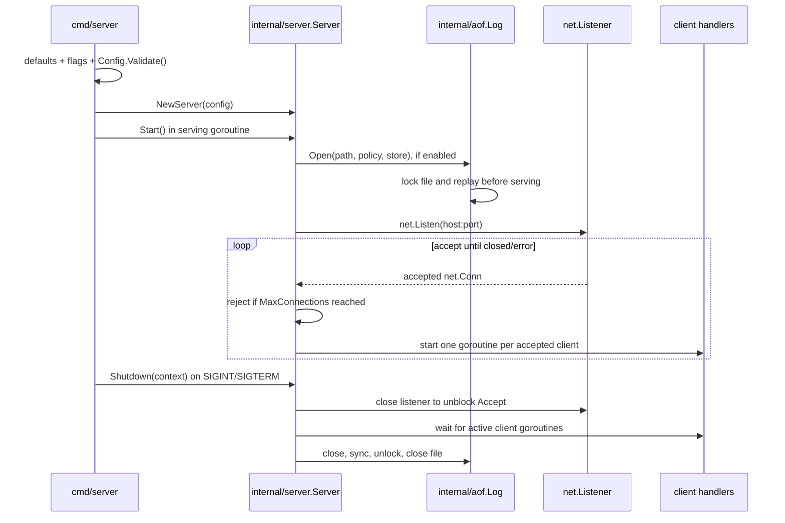
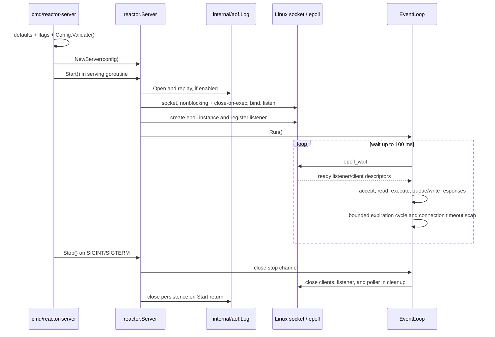
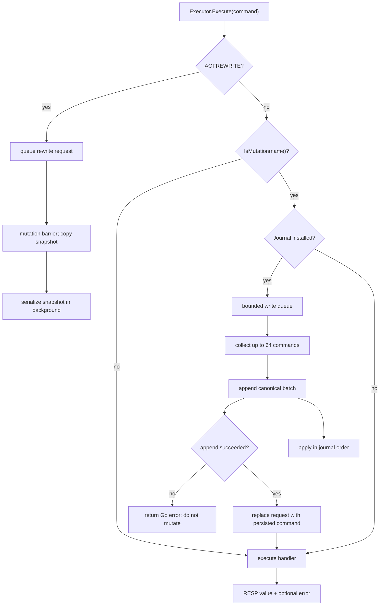
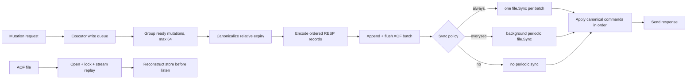

# Carrot High-Level Design

Carrot is a single-process, single-node Redis-inspired server written in Go.
This document describes the repository as it is implemented, not an intended
future architecture. The implementation is the final authority when behavior
and prose differ.

For the compact implementation map and synchronization details, see
[LLD.md](./LLD.md). The [README](./README.md) remains the user-facing feature
and run guide.

## 1. Purpose and boundaries

Carrot is a learning and portfolio project for exploring:

- RESP request/response framing and a Redis-style command subset.
- An in-memory typed key store with string/list values and expiration.
- Two networking models that use the same command and storage behavior.
- Append-only persistence (AOF), streaming recovery, and manual compaction.
- Tests and local measurements that expose behavior and limitations.

It is not a Redis replacement and is not safe for production data. It has no
authentication, TLS, replication, backup automation, cluster coordination,
or total database-memory quota. AOF is Linux-only. These are actual
limitations, not features that should be inferred from the architecture
diagrams.

### Current command/data scope

Supported string and key/expiration commands:

`PING`, `GET`, `SET` with `EX`, `PX`, or `PXAT`, `DEL`, `TTL`, `EXPIRE`,
`PEXPIREAT`.

Supported non-blocking list commands:

`LPUSH`, `RPUSH`, `LPUSHX`, `RPUSHX`, `LPOP`, `RPOP`, `LLEN`, `LRANGE`,
`LINDEX`, `LSET`, `LTRIM`, `LREM`, `LINSERT`, `LPOS`, `LMOVE`, and
`RPOPLPUSH`.

`AOFREWRITE` is an administrative command for the implemented persistence
feature. Blocking list commands such as `BLPOP` and `BRPOP`, hashes, sets,
sorted sets, transactions, pub/sub, and Redis command compatibility beyond
this subset are not implemented.

## 2. Repository map

```text
cmd/
  server/             Go net.Listener, one goroutine per client
  reactor-server/     Linux epoll server entry point
internal/
  config/             Shared runtime configuration and validation
  protocol/resp/      RESP values, bounded decoder, encoder
  command/            RESP-value-to-command parser, executor, handlers, journal boundary
  storage/            Sharded in-memory string/list store and expiration
  aof/                Linux AOF open, append, recovery, sync, rewrite
  client/             Buffered RESP I/O adapter used by the Go server
  server/             Standard TCP server and goroutine client lifecycle
  reactor/            Linux epoll poller, connections, event loop, server
docs/                 Persistence contract, scope, testing and review notes
scripts/              Reproducible local network benchmark script
```

The two production-style server binaries are `cmd/server` and
`cmd/reactor-server`. They create independent stores and executors and use the
same `config`, `command`, `storage`, `aof`, and RESP implementations. The
reactor uses direct file-descriptor I/O; it does not use `internal/client`.

## 3. System context and components

```mermaid
flowchart LR
    ExternalClient["redis-cli / RESP client"] <-->|TCP + RESP subset| Entry
    subgraph Entry["Carrot process: choose one server binary"]
      CmdServer["cmd/server"]
      CmdReactor["cmd/reactor-server (Linux)"]
      Standard["internal/server<br/>listener + client goroutines"]
      Reactor["internal/reactor<br/>socket + epoll event loop"]
      ClientIO["internal/client<br/>buffered net.Conn I/O"]
      RESP["internal/protocol/resp<br/>decoder / encoder"]
      Parser["internal/command.Parser"]
      Executor["internal/command.Executor"]
      Store["internal/storage.Store<br/>sharded memory"]
      Journal["internal/aof.Log<br/>optional, enabled by default"]
      Config["internal/config.Config"]
      CmdServer --> Standard
      CmdReactor --> Reactor
      Standard --> ClientIO
      ClientIO --> RESP
      Reactor --> RESP
      RESP --> Parser --> Executor
      Executor <--> Store
      Executor -->|mutation append / rewrite| Journal
      Journal -->|replay on startup| Executor
      Config --> Standard
      Config --> Reactor
    end
    Journal <-->|AOF file| Disk["Linux filesystem"]
```



Important ownership distinctions:

- The server owns startup, listener/socket lifecycle, and the selected
  connection strategy.
- The executor owns command dispatch and serializes mutation-plus-journal
  ordering with one write mutex.
- The store owns per-shard maps and shard locks.
- The AOF log owns its file descriptor, buffered writer, file lock, sync
  policy, and recovery/rewriting logic.
- The RESP package knows wire framing and values; it does not know commands,
  storage, or persistence.

## 4. Startup and shutdown

### Standard server



The standard server opens and replays AOF before it accepts client commands.
The `Start` path creates a TCP listener with Go's `net` package and delegates
accept handling to `Serve`. Each accepted connection is tracked, bounded by
the configured connection cap, and handled by one goroutine. A background
expiration ticker runs at 100 ms intervals.

On shutdown, the listener is closed first. Active handlers are given time to
finish; if the caller's context expires, active connections are closed and
shutdown waits for their goroutines. Persistence is then closed. A listener
failure not requested by shutdown closes active clients and joins client and
persistence errors.

### Linux reactor server



The reactor is Linux-specific and uses `golang.org/x/sys/unix`. It uses a
single event-loop execution path for socket I/O and command dispatch, not a
goroutine per client. It supports IPv4 and IPv6 socket addresses; the IPv6
wildcard path requests dual-stack operation, whose actual result remains
subject to OS/network configuration.

The reactor's `Stop` signals the loop; its deferred cleanup closes connections,
listener, and poller. `Server.Start` closes persistence when the loop returns.
The event loop performs expiration work after each event batch and checks
timeouts on each loop iteration. Since `epoll_wait` has a 100 ms timeout, idle
connections are checked periodically, not by a separate per-client timer.

### Defaults and safety

Both binaries use shared defaults:

| Setting | Default |
|---|---:|
| Host / port | `0.0.0.0:6379` |
| Maximum connections | 128 |
| Request bytes | 2 MiB |
| Response bytes | 4 MiB |
| Read timeout | 30 seconds |
| Write timeout | 10 seconds |
| AOF | enabled |
| AOF path | `appendonly.aof` |
| AOF sync | `everysec` |

The default host listens on all interfaces and the server has no auth or TLS.
The entry points log a warning for wildcard binds. Loopback should be used for
local testing.

Configuration is validated before serving. Port zero is accepted to request
an ephemeral port in server configuration; connection, byte limits, and
timeouts must be positive. When AOF is enabled, its path and sync policy must
also be valid.

## 5. Request and response path

Both server modes converge on the same command path:

```mermaid
flowchart LR
    Bytes["TCP byte stream"] --> Decoder["RESP Decoder"]
    Decoder --> Value["resp.Value"]
    Value --> Parser["Parser.Parse"]
    Parser --> Command["Command{Name, Args}"]
    Command --> Executor["Executor.Execute"]
    Executor --> Handler["command handler"]
    Handler --> Store["Store operation"]
    Store --> Result["resp.Value response"]
    Result --> Encode["RESP Encoder"]
    Encode --> BytesOut["TCP response bytes"]
```



RESP is a stream protocol: one read is not assumed to equal one request.
The standard server's buffered decoder reads a request at a time and loops
until disconnect/error. The reactor buffers bytes from non-blocking reads,
then decodes complete values while retaining incomplete tails and processing
pipelined values in order.

`Parser` requires a RESP array whose command and arguments are bulk strings.
It uppercases the command name while preserving argument spelling. The
executor dispatches supported commands to handlers. Command-level errors are
encoded as RESP errors; Go errors represent failures that stop request
processing, such as persistence or socket failures.

The decoder supports RESP simple strings, errors, integers, bulk strings, and
arrays, plus inline command lines for compatible clients/benchmark warm-up.
Message size and array nesting are bounded. The server also bounds aggregate
request bytes and response bytes. The standard path encodes a complete
response into a limited buffer before writing, avoiding a partially-sent
oversized response. The reactor similarly encodes into a bounded output
buffer before queuing bytes.

## 6. Command execution and concurrency



Each server has one shared executor/store per process. With a batch-capable
journal, mutations enter a bounded executor queue. One dispatcher gathers up
to 64 ready requests (and, for `always`, waits at most 250 microseconds for
more), appends the commands as one batch, then applies them in the same order
under the mutation barrier. One `always` fsync therefore covers a batch rather
than each write. Group commit reduces sync frequency, not the total ordering
requirement. Without a journal, commands bypass the write queue and rely on
storage shard locks. Reads use shard locks in either mode.

The standard server runs client handlers in separate goroutines. The reactor
dispatches commands synchronously from its single event loop, so command
execution or a batch commit can delay other ready connections even though
network I/O is readiness-driven.

If persistence append fails, the executor returns before applying the
mutation. With AOF disabled, the same command handlers still execute, but
there is no restart durability.

`AOFREWRITE` is queued in the same ordering stream. The executor briefly
holds the mutation barrier to copy a point-in-time snapshot, then returns
while a worker serializes the copy. Mutations continue to append to the active
AOF and are also written to a delta file. At installation, mutations pause
while the delta is appended and the replacement is synced and renamed. The
reactor can process other requests during snapshot serialization, but snapshot
capture, final installation, or a slow command can still delay its event
loop. See [AOF_PERSISTENCE.md](./docs/AOF_PERSISTENCE.md) for durability and
failure details.

## 7. Storage and expiration

The in-memory store has 256 fixed shards. Each shard has a `sync.RWMutex` and
a Go map from key to typed object. FNV-1a hashes a key to one shard. The
documented intent is lock striping to allow unrelated keys to be accessed
under different locks at the storage layer. Executor mutations without AOF
can use this concurrency; with AOF, the executor write queue and mutation
barrier preserve journal order. The count is a constant in code; no
workload-specific comparison of shard counts is implemented, so 256 is not
claimed as optimal.

Current value kinds are string and list. Expiration is stored as an absolute
`time.Time` deadline. Access methods perform passive expiration: an expired
entry is deleted when read/updated. `ActiveExpireCycle` samples volatile
entries and deletes expired keys in bounded passes so keys never accessed by
clients can eventually be reclaimed.

The standard server calls active expiration from a 100 ms ticker. The reactor
calls it in the event-loop after each event batch; its wait timeout also lets
the loop return during idle periods. The sweep checks a 25 ms elapsed-time
budget and fixed iteration/sample limits, but it is a cooperative budget,
not a hard real-time latency guarantee.

## 8. Persistence model



Each logged command is an ordinary RESP array. Read-only commands are not
logged. Relative `SET EX`, `SET PX`, and `EXPIRE` deadlines are normalized to
absolute `PXAT` or `PEXPIREAT` representations before append and the returned
canonical command is the command applied in memory. This prevents restart
from restarting relative TTLs.

The file is replayed before the listener/event loop becomes available. Replay
is streamed; memory is bounded by the decoder and one record, not the whole
file. An incomplete final command is truncated to the last complete record.
Malformed complete records fail startup rather than being silently skipped.

| Policy | Acknowledgement ordering | Expected durability boundary |
|---|---|---|
| `always` | append, flush, sync, apply, reply | Strongest implemented local policy; still not a backup or hardware guarantee |
| `everysec` | append, flush, apply, reply; background sync | Recently acknowledged writes may be lost on OS/power failure before sync |
| `no` | append, flush, apply, reply; no periodic sync | Larger loss window on machine failure; orderly close still syncs |

The AOF uses an exclusive Linux file lock to prevent two Carrot processes
from writing the same path. Linux-specific directory syncing is used on file
creation and rewrite. Non-Linux builds exist, but opening AOF returns an
explicit unsupported-platform error.

### Rewrite / compaction

`AOFREWRITE` copies a point-in-time snapshot while holding the mutation
barrier, then serializes the copied entries in a background worker. Writes
continue and append to a sidecar delta until final installation takes the
barrier, appends the delta, syncs and atomically renames the replacement, and
syncs the parent directory. A large snapshot uses memory proportional to live
data; a large delta can still make final installation noticeable. Rewrite is
manual and requires temporary disk space. There is no replication, automatic
compaction, AOF checksum, backup system, or protection from device failure.
See [docs/AOF_PERSISTENCE.md](./docs/AOF_PERSISTENCE.md) for detailed recovery
and failure behavior.

## 9. Observability, safety and known tradeoffs

- Logging uses the standard `log` package; structured log levels and metrics
  are not implemented.
- Connection counts, request/response sizes, and timeouts are bounded, but
  total database memory is not.
- The all-interface default is potentially unsafe without network controls.
- The standard server is built on Go's portable networking package, but its
  default-on AOF remains Linux-only.
- The reactor uses direct Linux syscalls and processes commands on its event
  loop. A slow command or storage operation can delay other ready connections.
- The AOF's strongest sync mode batches concurrent writes into a bounded
  group-commit window; each batch still incurs one file synchronization.
- Benchmarks are local observations, not capacity guarantees. The README's
  comparison disables AOF and does not represent durable-write throughput.

## 10. Design choices: intent, tradeoffs, and evidence

This section separates implementation facts from rationale and evidence.
Correctness-driven reasons can be inferred where the code enforces an
invariant; historical intent is not assumed when it is not recorded. A
constant or comment describing a desired balance is not, by itself,
experimental proof that the choice is optimal.

| Area | Implemented choice | Why it fits the current design | Tradeoff and evidence |
|---|---|---|---|
| Two server modes | Go `net.Listener` server and Linux epoll reactor share parser, executor, store, and journal | Allows comparison of blocking per-connection I/O and readiness-driven I/O while keeping command semantics shared | More transport/lifecycle code to maintain. Local comparison exists, but cannot establish that either model is universally faster or production-preferable. |
| Standard connection handling | One handler goroutine per accepted `net.Conn` | Keeps each connection's blocking read/decode/execute/write flow isolated and uses Go's standard networking API | Goroutines and connection state grow with client count; max connections is configured, but total process memory is not. TCP tests exist; high-connection scalability is not proven. |
| Reactor execution | One event-loop path owns socket readiness, connection buffers, and synchronous command dispatch | Makes non-blocking reads, partial writes, and readiness transitions explicit | Slow commands, `always` group commits, and rewrite snapshot/finalization barriers can delay every ready connection on that loop. No workload evidence proves a general latency or throughput advantage. |
| Shared command core | Both transports use the same parser and executor | Avoids implementing command semantics twice | Transport-specific error, buffering, and timeout behavior still differ. Integration tests cover both paths. |
| RESP request shape | Commands are arrays of bulk strings, normalized to `Command{Name, Args}` | Gives handlers a transport-independent representation and supports binary bulk arguments | It is a deliberately narrow subset, not complete Redis compatibility. Protocol tests validate implemented framing, not compatibility with every Redis client/command. |
| Live state and persistence | In-memory typed store plus append-only command log replayed at startup | Keeps normal command execution in process while preserving a sequential recovery mechanism | Store memory is unbounded and replay duration grows with log size. Streaming replay avoids a whole-file allocation; there is no large-file benchmark or physical power-loss test matrix. |
| Append-before-apply | Mutations are queued, appended in bounded batches, then applied in journal order | A known append failure is returned before changing live state; the same order establishes journal/state ordering | Journaled mutation application remains serialized. `always` amortizes fsync over up to 64 commands, at the cost of up to 250 microseconds of batching delay. Tests cover append failure, batch grouping, and ordering; sustained contention cost is not yet characterized. |
| Rejected command logging | A syntactically canonicalizable mutation is journaled before its handler runs, including commands that return RESP errors such as wrong-type list operations | Preserves append-before-apply without needing a separate validation/commit path | Rejected requests add AOF bytes but replay to the same data state. Safely excluding them requires an atomic command validation/commit design; executing first could leave unpersisted memory changes after an append failure. A regression test covers current behavior. |
| AOF sync policies | `always`, `everysec`, and `no`; default is `everysec` | Exposes an explicit durability/performance tradeoff | Acknowledged-write loss windows depend on policy and OS/filesystem/device behavior. Tests verify code paths, not hardware power-loss guarantees. |
| Background rewrite | A mutation barrier captures a point-in-time copy; a worker serializes it while mutations append to a delta | Keeps long snapshot serialization outside the mutation pause while preserving a total journal order | Snapshot capture and final delta installation pause mutations; memory and disk use rise during the rewrite. Correctness/failure tests exist; sustained-load impact is unmeasured. |
| Sharded store | 256 fixed FNV-1a-routed shards, each with an `RWMutex` and map | Storage calls and executor mutations without AOF can proceed concurrently when they target different shards | With AOF enabled, journal ordering serializes mutation application even though storage is sharded. Hash collisions serialize unrelated keys; there is overhead per shard. No alternative-count benchmark proves 256 optimal. The central limit theorem is not a justification for this constant. |
| Expiration | Passive expiration on access plus sampled active sweeps | Access-time checks provide correct behavior for touched keys; sweeps reclaim expired keys not touched again | The sweep visits Go map entries in unspecified iteration order; it is not uniform random sampling and is eventual, not immediate. It returns a deletion count but server callers currently discard it; cleanup logs are aggregated at most once per minute per store. Tests cover expiration and log throttling, not all key distributions. |
| Resource bounds | Limits apply to connections, messages, protocol fields, responses, and timeouts | Bounds specific, attacker-controlled input paths and limits slow/stalled connections | They do not cap aggregate memory, database size, or disk use. Boundary tests exist; total-memory exhaustion is not demonstrated safe. |
| Bind default | Default listener is `0.0.0.0:6379`; wildcard startup is warned | Retains an all-interface default for the server's current configuration behavior | There is no authentication or TLS, so the default is unsafe on untrusted networks. Use loopback/firewalling for local or controlled deployment; a warning is not access control. |
| Linux-specific AOF | Linux file locking and directory-sync operations; non-Linux AOF open fails explicitly | Makes unsupported durability behavior fail clearly instead of silently weakening it | AOF-enabled operation is Linux-specific. The repository validates its Linux path; it does not claim portable AOF semantics. |
| Fixed operational constants | Defaults include max 128 connections, 2 MiB request, 4 MiB response, 30 s read and 10 s write timeout; reactor uses 128 events and 100 ms wait | Provides concrete startup behavior and finite per-request/connection controls | These values are configuration/constants, not values selected by a repository tuning study. Validate or tune them against target workloads before making capacity claims. |

For example, correctness motivates the sorted acquisition order for
multi-shard operations, absolute TTL timestamps in the AOF, and append-before-
apply ordering. In contrast, the repository does not record empirical
selection evidence for 256 shards, 128 events per poll, list initial capacity,
or the operational defaults. To evaluate those, add reproducible workload
benchmarks measuring throughput, tail latency, lock contention, allocations,
and memory across representative data/key distributions.

## 11. Build, tests and operational entry points

```sh
make check
make benchmark
go test -run '^$' -bench . ./internal/command
```

`make check` runs formatting checks, package tests, race tests, coverage, vet,
and build. GitHub Actions runs the same checks on Linux. The network benchmark
requires `redis-cli` and `redis-benchmark`, binds only to loopback, refuses
ports that respond like a Redis server, and disables AOF for the comparison.

The repository includes unit tests and TCP tests for both server modes,
storage behavior, RESP handling, command behavior, and AOF recovery/rewrite.
Coverage and gaps are recorded in [docs/TEST_SUMMARY.md](./docs/TEST_SUMMARY.md).
Passing tests do not establish production safety, full Redis compatibility,
power-loss durability, or behavior under sustained load.

## 12. Reading path

1. Read this document for component boundaries, lifecycle, and end-to-end
   flows.
2. Read [LLD.md](./LLD.md) for the implementation map and key synchronization
   boundaries.
3. Read the package-specific AOF guide for the durability contract.
4. Read `internal/reactor/ARCH.md` and `internal/reactor/README.md` for
   subsystem-level epoll detail; verify implementation claims against current
   Go code.
5. Read the README for commands, local setup, current benchmark results, and
   production-readiness boundaries.
