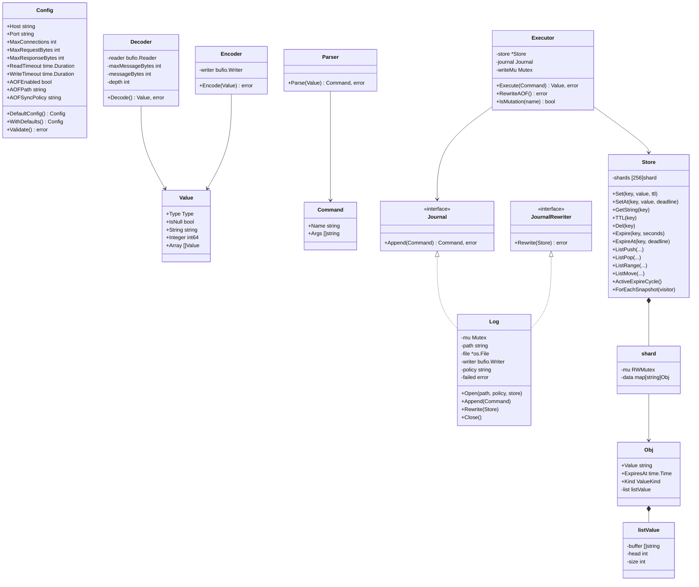

# Carrot Low-Level Design

This is the implementation-level companion to [HLD.md](./HLD.md). It describes
current Go types, method responsibilities, data structures, synchronization,
and important edge cases. It does not claim that a design is optimal merely
because it is implemented.

When this document and the code disagree, the code is authoritative. The
primary packages are `internal/config`, `internal/protocol/resp`,
`internal/command`, `internal/storage`, `internal/aof`, `internal/client`,
`internal/server`, and `internal/reactor`.

## 1. Types and relationships



The diagram omits utility methods and command-specific handlers to keep
relationships readable. It describes Go structs and interfaces, not an
object-oriented inheritance hierarchy.

## 2. Configuration and process entry points

### `config.Config`

`DefaultConfig` returns:

| Field | Default |
|---|---|
| `Host` | `0.0.0.0` |
| `Port` | `6379` |
| `MaxConnections` | 128 |
| `MaxRequestBytes` | `2 << 20` bytes |
| `MaxResponseBytes` | `4 << 20` bytes |
| `ReadTimeout` | 30 seconds |
| `WriteTimeout` | 10 seconds |
| `AOFEnabled` | true |
| `AOFPath` | `appendonly.aof` |
| `AOFSyncPolicy` | `everysec` |

`WithDefaults` fills omitted resource limits/timeouts and AOF path/policy but
does not replace host or port. `Validate` checks host syntax, port range
0–65535, positive resource limits and timeouts, and AOF path/policy if AOF is
enabled. The entry points warn when the host is an unspecified address.

The configuration is passed by value into each server. It is not a dynamic
configuration service; changing command-line flags requires restarting the
process.

### Entry point responsibilities

- `cmd/server/main.go`: parse shared flags; validate and warn; construct
  `server.Server`; run `Start` in a goroutine; on interrupt/SIGTERM request a
  context-bounded shutdown.
- `cmd/reactor-server/main.go`: same settings and validation for the Linux
  reactor; on signal call `Stop`.
- `cmd/scale-server/main.go`: create a store, seed keys with TTLs, then invoke
  `ActiveExpireCycle` repeatedly and report the removals. It does not start a
  listener and should not be confused with a load generator.

Both server entry points currently define the same operational flags
independently. Defaults and validation are shared through `config.Config`.

## 3. RESP value and framing implementation

### `resp.Value`

`Type` matches the RESP lead byte (`+`, `-`, `:`, `$`, `*`). A value stores
one payload representation: `String`, `Integer`, or `Array`. `IsNull`
distinguishes a null bulk string from an empty bulk string. The current
encoder handles simple string, error, integer, bulk string (including null),
and array.

### Decoder limits

`Decoder.Decode` reads exactly one value from a buffered reader. It recursively
decodes arrays, so byte and nesting accounting is shared across one top-level
message. The current bounds are:

| Bound | Value |
|---|---:|
| Default message size | 2 MiB (callers can supply another limit) |
| Maximum line length | 16 KiB |
| Maximum bulk string | 1 MiB |
| Maximum array elements | 1,024 |
| Maximum nesting depth | 64 |
| AOF record limit | 4 MiB (AOF caller-specific) |

`readLine` requires CRLF, counts bytes against the message budget, and bounds
the line allocation. Bulk decoding reads the announced payload length exactly
and then verifies CRLF. Array decoding rejects lengths below `-1` and above
the maximum. The decoder also recognizes a non-RESP prefix as an inline
command, splits that CRLF line into whitespace-delimited tokens, and returns
an array of bulk strings.

Inline commands cannot preserve whitespace inside one argument; binary-safe
payloads require RESP bulk strings. The command parser additionally requires
the command token and every argument to be bulk strings.

### Encoder and flush ownership

`Encoder.Encode` writes RESP bytes to a `bufio.Writer` but does not flush.
The caller chooses flush timing:

- `client.Client.Flush` flushes a buffered response on the standard server.
- The standard server first encodes into a bounded temporary buffer, then
  writes and flushes through `Client.Write`.
- The AOF path encodes a record and flushes the log writer before applying
  memory mutation.
- The reactor encodes a complete response into its bounded `outBuf`, then
  writes to the non-blocking socket when possible.

Keeping encode and flush separate allows the caller to control batching and
keeps persistence ordering explicit.

## 4. Command parsing, dispatch, and response semantics

### Parsing

`Parser.Parse` accepts an array with at least one element. The command name
must be a bulk string, as must all arguments. It uppercases the command name
and leaves argument contents unchanged. Argument count, numeric parsing, and
command grammar are validated in handlers rather than the parser.

### `Executor`

`Executor` contains a pointer to the shared `Store`, an optional `Journal`,
and a `writeMu`. `Execute` handles `AOFREWRITE` specially; for mutations it
holds `writeMu` across journal append and handler execution when a journal is
configured. Without a journal, it relies on storage shard locks. A successful
append may return a canonical command; the executor dispatches that returned
command so the in-memory deadline matches the persisted deadline. If append
fails, it returns a Go error before calling the handler.

The journaled path holds the mutex because append and mutation must remain in
one total order and the rewrite barrier must exclude mutations from its
snapshot. When no journal is configured, there is no log ordering to preserve;
each storage method provides its own shard locking, including sorted locking
for cross-shard list moves.

`execute` dispatches commands:

| Command family | Handler/storage path | Mutation classification |
|---|---|---|
| `PING` | `handlePing` | no |
| `GET` | `handleGet` → `GetString` | no |
| `SET` | `handleSet` → `Set` / `SetAt` | yes |
| `TTL` | `handleTTL` → `TTL` | no |
| `DEL` | `handleDel` → `Del` | yes |
| `EXPIRE` | `handleExpire` → `Expire` | yes |
| `PEXPIREAT` | `handleExpireAt` → `ExpireAt` | yes |
| list reads | `handleListCommand` → list read methods | no |
| list writes | `handleListCommand` → list mutations | yes |
| `AOFREWRITE` | `RewriteAOF` | administrative barrier |

`IsMutation` is the shared classification used by executor ordering and AOF
replay validation. When adding a new mutation, update this classification,
dispatch, command handler, and AOF normalization if the command has relative
time semantics. AOF canonicalization falls back only for names already
classified as mutations; this means new mutations remain journaled even when
they need no rewrite normalization.

Command syntax/semantic errors are generally returned as RESP error values
with a nil Go error. For example, invalid argument counts do not terminate the
connection. Persistence, encoding, and connection failures use Go errors and
are handled by the server as operational failures.

### Command handler details

- `PING`: no argument returns simple string `PONG`; one argument returns that
  bulk string; more arguments return an error.
- `SET`: accepts key/value followed by `EX`, `PX`, or `PXAT` option/value
  pairs. `EX`/`PX` require positive bounded values. `PXAT` parses Unix
  milliseconds; an already-expired absolute deadline removes the key while
  `SET` still returns `OK`.
- `GET`: returns null bulk for absent/expired keys, bulk string for string
  keys, and WRONGTYPE for list keys.
- `DEL`: needs at least one key and counts only keys that existed and were
  live.
- `TTL`: returns `-2` missing/expired, `-1` persistent, otherwise remaining
  whole seconds (truncated down).
- `EXPIRE`: parses signed seconds; zero/negative deadlines remove a live key.
- `PEXPIREAT`: accepts absolute Unix milliseconds and reports integer success.
- List handlers validate integer/direction/options and map storage errors to
  RESP errors. `LPOP`/`RPOP` support scalar and count forms; `LPOS` supports
  `RANK`, `COUNT`, and `MAXLEN`; `LMOVE` accepts source/destination and
  `LEFT`/`RIGHT` directions.

`storageError` is shared for storage-specific command errors such as
WRONGTYPE, missing list key, and out-of-range list index.

## 5. Storage internals

### Shard routing

`Store` embeds a fixed array of 256 `shard` values. `NewStore` initializes each
shard's map. `fnv32a` computes a 32-bit FNV-1a hash over key bytes;
`getShardIndex` takes hash modulo 256; `getShard` returns that shard.

```text
key bytes
   │
   ▼
FNV-1a uint32
   │ modulo 256
   ▼
Store.shards[index]
   ├── RWMutex
   └── map[string]Obj
```

#### Why 256?

The implementation uses 256 as a fixed lock-striping count. Code comments
state the intent: spread independent key operations over independent locks
and keep expiration sweeps scoped to one shard at a time. However,
`Executor.Execute` serializes mutations with `writeMu` only when a journal is
configured. With AOF disabled, sharded storage locking permits independent
command mutations to proceed concurrently when they target different shards.
The repository does not contain a benchmark
that compares 64, 128, 256, or 1,024 shards, nor does it justify 256 using
CPU count, workload cardinality, or measured contention. It is therefore an
implementation choice, not an empirically selected optimum.

The central limit theorem is not used by this code and does not establish an
optimal shard count. It concerns distributions of sample means under
assumptions; it does not replace benchmarking lock contention, memory
overhead, key distribution, and workload mix. To justify a different count,
the appropriate evidence would be repeatable concurrent workloads comparing
throughput, tail latency, allocation/memory cost, and lock contention on
representative key distributions.

FNV collisions affect concurrency (different keys may share a shard), not
key correctness: map keys remain distinct within the shard. Sharding adds 256
maps and mutexes regardless of database size. `RWMutex` permits concurrent
readers of one shard, but methods that lazily expire/delete keys require its
write lock.

### Objects and expiration

```text
Obj
 ├── Value      string
 ├── ExpiresAt  time.Time (zero means persistent)
 ├── Kind       StringKind | ListKind
 └── list       listValue (used only for ListKind)
```

`Obj.IsExpired(now)` returns true only when an expiration exists and `now` is
not before the deadline. Expiration operations store absolute timestamps.
`Set` explicitly writes `StringKind`; list creation explicitly writes
`ListKind`.

String access has two layers:

- `GetString` uses `liveObjectLocked`, which checks expiry and removes an
  expired value, then returns WRONGTYPE if the live value is not a string.
- `Get` is a convenience wrapper that turns both absent values and wrong
  types into `(empty, false)`; command handling uses `GetString` to preserve
  WRONGTYPE behavior.

`TTL` obtains one `now` value under the shard lock, removes already-expired
keys, and computes `ExpiresAt.Sub(now).Seconds()` before conversion to
`int64`. `Expire` translates seconds to a deadline and delegates to
`ExpireAt`. A non-positive deadline deletes the live key and returns success;
an absent/already-expired key returns false.

### Active expiration

`ActiveExpireCycle` works shard by shard with one shard write lock held at a
time. It visits map entries in Go's unspecified iteration order, not through
a uniform random sampling algorithm. It returns the number deleted; current
server callers discard that count. Cleanup counts are aggregated and logged
at most once per minute per store rather than logging each pass. Current
limits in the method are:

- 20 volatile entries sampled per iteration.
- At most 16 iterations.
- Continue sampling if more than 25% of the sampled volatile keys were
  expired.
- Stop starting work after a 25 ms elapsed-time budget.

The implementation iterates Go map entries until the sample is filled; it
does not maintain a dedicated expiration heap or random sampling index. Map
iteration order is unspecified and does not guarantee statistically uniform
selection. One pass does not promise that every expired key is found.
Repeated calls are needed for eventual cleanup of unaccessed expired keys.
The elapsed-time check is cooperative; lock acquisition, scheduler pauses,
and runtime work mean it is not a hard real-time upper bound.

The standard server invokes it on a 100 ms ticker. The reactor invokes it
after event dispatch in each loop, which normally wakes at least every 100 ms
when idle. The scale demo seeds 10,000 keys and exercises this method without
the network.

### List representation

`listValue` is a growable circular buffer:

- `buffer` is the backing slice.
- `head` is the physical slot of the logical first element.
- `size` is the number of live elements.
- Logical index `i` maps to physical `(head+i) % len(buffer)`.

```text
Physical buffer: [ d | _ | _ | _ | _ | a | b | c ]
                             ^ head=5
Logical list:                 a -> b -> c -> d
```

An empty buffer grows to capacity 8; a full buffer doubles. `grow` copies
logical order into a new slice and resets `head` to 0. `push` and `pop` at
either end are O(1), excluding a growth copy. Indexed access is O(1).
`insert`, `removeAt`, `LREM`, `LINSERT`, and `LPOS` scan or shift elements and
can be O(n). `rangeCopy` returns a new slice. Pop/remove paths clear discarded
slots to release string references.

List storage methods acquire the owning shard's exclusive lock because
operations can mutate the circular buffer and because `liveObjectLocked`
may delete expired entries.

### List storage operation map

All methods below lock the shard selected by the list key, call
`liveObjectLocked` where a key may have expired, and reject a live non-list
object with `ErrWrongType`, except where noted.

| Method | State/result behavior | Main cost |
|---|---|---|
| `ListPush` | Create or update list; `onlyExisting` supports `LPUSHX`/`RPUSHX` | O(k) for k pushed values, plus occasional ring growth |
| `ListPop` | Pop up to count; delete key when list becomes empty | O(k) for k popped values |
| `ListLen` | Return zero for a missing list | O(1) |
| `ListRange` | Normalize negative inclusive indexes and copy range | O(r) for returned range |
| `ListIndex` | Return one item, supports negative index | O(1) |
| `ListSet` | Replace one existing indexed element | O(1); missing key/index returns explicit errors |
| `ListTrim` | Keep normalized inclusive range; delete empty result | O(n) because retained data is copied |
| `ListRem` | Remove count-matched values; count zero means all; negative scans from tail | O(n) scan plus shifts; worst case O(n^2) |
| `ListInsert` | Insert before/after first pivot; return zero for absent key, `-1` for absent pivot | O(n) search/shift |
| `ListPosition` | LPOS-style rank/count/maxlen search in either direction | O(scanned items) |
| `ListMove` | Atomic pop/push across source/destination | O(1) list operation plus lock acquisition |

The storage layer returns semantic results/errors; `command/list.go` translates
them into Redis-style RESP return shapes. For example, an absent `ListPop`
returns no values; the handler returns null bulk for scalar pop and an empty
array for count form.

### Atomic multi-key list move and lock order

`ListMove(src,dst,...)` must update two keys atomically. It calculates both
shard indexes:

1. If both keys share a shard, acquire that shard lock once.
2. Otherwise acquire the lower-index shard first and higher-index shard
   second, regardless of source/destination order.
3. Check source and destination types, pop source, push destination, and
   update/delete both map entries before releasing locks.

The globally consistent lock order prevents two opposite-direction moves from
each holding one shard while waiting for the other (deadlock). Same-key moves
are handled while holding one lock and rotate the popped value to the selected
end.

### Snapshot API

`ForEachSnapshot` is designed for bounded-memory rewrite rather than cloning
the whole store:

1. Capture `now`.
2. For a shard, copy its key names while holding its read lock.
3. Release that lock.
4. Reacquire a read lock for each key, skip missing/expired entries, copy the
   string metadata and list contents, then unlock.
5. Invoke the callback outside the shard lock.

The executor's mutation barrier prevents normal command writes during
`AOFREWRITE`, giving the traversal a stable data set relative to client
mutations. The snapshot API itself documents that callers need such a barrier
for a point-in-time view. It still allocates a key slice for one shard and a
copy of each list while encoding that entry; memory is not literally
allocation-free.

## 6. Synchronization and lock ownership

| Lock / owner | Protects | Held across I/O? | Reason / effect |
|---|---|---|---|
| `Executor.writeMu` | Journaled mutation ordering and rewrite barrier | Yes, across AOF append/rewrite; not used for mutations without a journal | Persisted order must match state mutation order; writes pause for synchronous rewrite |
| `shard.mu` (`RWMutex`) | One shard map and contained object/list | No disk/network I/O | Prevent races while preserving parallelism across shards |
| `Log.mu` | AOF file/writer state, sync, close, failure status | Yes, file operations | Serialize append, periodic sync, rewrite handoff, and close |
| `Server.mu` | Standard server listener/state/active connection set | Not during normal handler I/O | Coordinate accept, shutdown, and client registry |
| `Server.aofMu` | Opening/closing AOF reference | Around `Open`/`Close` | Prevent duplicate lifecycle changes |
| `EventLoop` ownership | Reactor `conns` map and per-connection mutable buffers | Socket syscalls occur on event-loop path | Avoid concurrent mutation of connection state |
| `EventLoop.mu` | `running` flag and stop interaction | No client operation | Coordinate `Run`/`Stop` state |

The AOF append path uses both locks in a fixed nesting: executor mutation
mutex, then log mutex, then (for mutations involving storage) the shard lock.
The rewrite path takes executor mutation mutex, then log mutex, and snapshot
traversal takes shard read locks. Normal server commands do not take a shard
lock and then call back into the executor/AOF, so they do not invert this
order.

`SetJournal` is documented for setup before serving. Replacing the journal
while requests are in progress is unsupported; it is not itself synchronized
against `Execute`.

## 7. File-by-file responsibility map

### Configuration and protocol

| File | Responsibility |
|---|---|
| `internal/config/config.go` | Defaults, default filling, address/limit/AOF validation, wildcard detection |
| `internal/protocol/resp/types.go` | RESP type identifiers and `Value` representation |
| `internal/protocol/resp/decoder.go` | Top-level recursive dispatch and inline command handling |
| `internal/protocol/resp/utils.go` | CRLF line reads, byte budget, terminator validation and protocol bounds |
| `internal/protocol/resp/encode.go` | Encoder dispatch; deliberately does not flush |
| `internal/protocol/resp/simple_string.go` | Simple-string decoding |
| `internal/protocol/resp/error.go` | Error-value decoding |
| `internal/protocol/resp/integer.go` | Integer decoding |
| `internal/protocol/resp/bulk_string.go` | Bulk-string length, payload and CRLF decoding |
| `internal/protocol/resp/arrays.go` | Array length and recursive element decoding |
| `internal/protocol/resp/encoder_utils.go` | Encoding for simple strings, errors, integers, bulk strings and arrays |
| `internal/protocol/resp/constructors.go` | Typed constructors for values |

### Command package

| File | Main definitions |
|---|---|
| `command.go` | `Command{Name, Args}` |
| `parser.go` | `NewParser`, `Parser.Parse` |
| `executor.go` | `Journal`, `JournalRewriter`, `Executor`, `Execute`, `RewriteAOF`, dispatch, `IsMutation` |
| `ping.go` | `handlePing` |
| `get.go` | `handleGet` |
| `set.go` | `handleSet` and expiration option parsing |
| `del.go` | `handleDel` |
| `ttl.go` | `handleTTL` |
| `expire.go` | `handleExpire`, `handleExpireAt` |
| `list.go` | list command dispatch, argument parsing, RESP conversion, `storageError` |
| `command_test.go` | parser/executor/expiration and persistence ordering tests |
| `list_test.go` | list command behavior tests |
| `command_bench_test.go` | in-process executor/storage benchmarks |

### Storage package

| File | Main definitions |
|---|---|
| `storage.go` | `Obj`, `SnapshotEntry`, `ValueKind`, `Store`, hashing/shard routing, strings, TTL, active expiration, snapshot traversal |
| `list.go` | `listValue`, ring operations, list storage methods, `ListMove` lock ordering |
| `export_test.go` | Same-package testing helpers for inspecting/seeding raw entries; compiled only for tests |
| `storage_test.go` | String, TTL, active-expiration, snapshot and shard-safe storage tests |
| `list_test.go` | Circular buffer and list method semantic tests |

### AOF package

| File | Main definitions |
|---|---|
| `aof.go` | `Log`, `Open`, `Append`, rollback, close/sync loop, streaming replay, rewrite and command canonicalization |
| `lock_linux.go` | Linux `flock` and platform acceptance |
| `lock_other.go` | Fail-closed lock/platform stubs on non-Linux |
| `sync_directory_linux.go` | Linux parent-directory sync |
| `sync_directory_other.go` | Fail-closed non-Linux directory-sync stub |
| `aof_test.go` | Append/recovery, locks, sync behavior, rewrite, failure, and canonicalization coverage |

### Network packages and command binaries

| File/package | Responsibility |
|---|---|
| `internal/client/client.go` | Buffered `net.Conn` adapter with RESP decoder/encoder and deadlines |
| `internal/server/server.go` | Standard listener, client goroutines, active-connection tracking, shutdown, persistence wiring |
| `internal/reactor/poller.go` | `epoll_ctl`/`epoll_wait` wrapper and event conversion |
| `internal/reactor/connection.go` | Non-blocking per-FD buffers, decode/execute, bounded response queue, partial-write recovery |
| `internal/reactor/event_loop.go` | Event dispatch, accept drain, timeout/expiration passes and cleanup |
| `internal/reactor/server.go` | Linux socket creation/bind/listen, poller setup and lifecycle |
| `cmd/server/main.go` | Flags, validation, warning, signal-driven standard-server lifecycle |
| `cmd/reactor-server/main.go` | Linux flags, validation, warning, signal-driven reactor lifecycle |
| `cmd/scale-server/main.go` | Demonstration of storage active-expiration behavior |

## 8. Standard server and client internals

### `server.Server`

The standard server contains config, listener, shared store/parser/executor,
optional AOF log, active `net.Conn` set, close/start flags, wait groups, and
shutdown channels/once guards.

- `NewServer`: apply defaults, create store/parser/executor, initialize
  tracking structures.
- `Start`: validate, recover persistence, create `net.Listener`, then call
  `Serve`; close active connections and persistence on unexpected server exit.
- `Serve`: accept connections, enforce `MaxConnections`, track each accepted
  client, launch `handleClient`, and run the expiration ticker.
- `handleClient`: install a read deadline for each request, decode, parse,
  execute, and write one response; continue for subsequent requests.
- `writeResponse`: encode fully through `limitedWriter`, set write deadline,
  and only then send bytes.
- `Shutdown`: close listener, wait for serving loop and client handlers; on
  context expiry, close active client sockets and wait for their exit.
- `openPersistence` / `closePersistence`: attach/detach `aof.Log` to the
  executor around its lifecycle.

`client.Client` wraps a `net.Conn`, buffered reader/writer, RESP decoder, and
encoder. `NewClient` uses a 2 MiB request limit; server code calls
`NewClientWithLimit` from config. Its `Write` flushes raw bytes; the encoder
path calls `Flush` explicitly after complete RESP encoding. It forwards
deadlines and remote address to the underlying connection.

The wrapper assumes a non-nil connection from normal server construction.
Some methods guard nil `conn`, but encoder/decoder accessors and read/write
methods expect initialized state.

## 9. Linux reactor internals

### `Poller`

`Poller` owns an epoll file descriptor and the maximum event batch size.
`NewPoller` substitutes 128 if a non-positive size is supplied and creates an
epoll instance. `Register` adds a descriptor for the default interest mask
(`EPOLLIN | EPOLLERR | EPOLLRDHUP`). `Modify` changes interest (notably
adding/removing `EPOLLOUT`); `Unregister` deletes it; `Wait` retries
`EINTR`, maps kernel events to the package `Event`, and returns. The current
implementation allocates the raw and mapped event slices per wait call.

### `reactor.Server`

`Start` validates config, opens AOF, resolves the host/port to an IP address,
creates a nonblocking close-on-exec TCP socket, sets `SO_REUSEADDR`, optionally
requests dual stack for an IPv6 wildcard, binds/listens, obtains the bound
address, creates the poller, registers the listener, constructs the event
loop, and runs it. Startup errors close resources where each branch handles
them; the deferred lifecycle closes persistence when `Start` returns.

The low-level listener backlog is 128. This is distinct from
`MaxConnections`, which the event loop enforces after accepting a descriptor.
The event loop accepts until `EAGAIN`/`EWOULDBLOCK`, closing newly accepted
descriptors if at the connection cap.

### `EventLoop`

`EventLoop.Run` checks its stop channel, calls `Poller.Wait(100)`, dispatches
each ready event to listener accept or client handling, then runs active
expiration and idle/write timeout scans. Event batches are processed
sequentially.

For a client event, readable data is processed before peer hangup is acted
upon. This preserves a final command sent immediately before a half-close.
`EPOLLOUT` invokes `Connection.OnWrite`. Fatal read/write or error/hangup
events remove the connection.

### `Connection`

Each accepted descriptor is wrapped with:

- `inBuf`: unread/partial request bytes.
- `outBuf`: encoded responses not yet sent.
- activity timestamp, queued-write start timestamp, and configured limits.
- references to shared poller, parser, and executor.

`OnRead` drains `unix.Read` into a 4 KiB scratch buffer until would-block,
rejects input that exceeds the configured inbound limit, and attempts to
process all complete commands. Partial RESP frames remain buffered. For each
complete command, `processCommands` determines exactly how many bytes the
decoder consumed, advances the input buffer, parses/executes, and queues one
bounded response. The consumed-byte calculation accounts for bytes held in
both the underlying `bytes.Reader` and the intermediate `bufio.Reader`;
without both terms, pipelined data can be discarded.

`writeResponse` encodes into a temporary bounded buffer sized to remaining
outbound capacity. `Flush` repeatedly calls `unix.Write`; on `EAGAIN` it
registers `EPOLLOUT` and returns to the loop. After queued bytes drain, it
removes `EPOLLOUT` to avoid writable-event wakeups when no data is pending.
`OnWrite` resumes `Flush`. `Close` unregisters and closes the descriptor.

Timeout behavior differs in implementation from the standard server:

- `lastActivity` updates when reads/writes transfer bytes.
- A queued response starts `writeStarted` when the output queue was empty.
- The event loop scans each connection after each wait/event batch.
- An idle connection or a connection with a response pending beyond the
  configured write interval is closed.

These are loop-scanned timeouts, not independent timers.

## 10. AOF detailed design

### Platform boundary

`internal/aof/aof.go` is shared; Linux-specific operations are selected by
build tags:

- `lock_linux.go`: non-blocking exclusive `flock` and unlock.
- `sync_directory_linux.go`: open and sync the containing directory, joining
  sync/close errors.
- `lock_other.go` and `sync_directory_other.go`: fail closed with an
  unsupported-platform error.

`Open` checks arguments/platform, opens or creates the file with mode `0600`,
locks it before recovery, replays, seeks to end, syncs the parent directory
when creating a new file, builds a buffered writer, and starts the periodic
sync goroutine only for `everysec`.

### Append ordering

```mermaid
sequenceDiagram
    participant E as Executor
    participant L as Log
    participant F as AOF file
    participant S as Store
    E->>E: writeMu.Lock()
    E->>L: Append(original command)
    L->>L: canonicalCommand(command, now)
    L->>L: Log.mu.Lock()
    L->>F: encode RESP; writer.Flush()
    L->>F: file.Sync() when policy is always
    L-->>E: canonical command
    E->>S: execute canonical mutation under shard lock
    E-->>E: writeMu.Unlock()
```

`Append` returns the original command without writing when canonicalization
rejects malformed/unsupported syntax, allowing the handler to return its
normal command error. For a mutation known by `IsMutation`, canonicalization
normalizes `SET EX/PX` and `EXPIRE`, validates the forms needed for
normalization, and passes through current mutations without relative
expiration semantics. When adding a new mutation with relative TTL behavior,
normalization must be added before relying on replay.

For valid logged commands, AOF append writes one RESP array, flushes the
buffered writer, and for `always` calls `file.Sync` before returning. The
executor applies the returned command only after `Append` succeeds. A command
that is semantically a no-op or returns a command-level error may still be
recorded if it is syntactically canonicalizable; replay reaches the same
handler behavior. For example, `LPUSH` against a string key is recorded
before the handler returns WRONGTYPE. This does not change recovered data,
but repeated rejected requests grow the AOF until rewrite. Avoiding those
records safely requires separating validation from mutation while preserving
append-before-apply ordering; simply executing first could change memory when
a later append fails.

### Rollback after append failure

`Append` records the current file offset before encoding. On encode/flush/sync
failure, `rollback` truncates to that offset, seeks to that offset, resets the
buffered writer, and syncs the rollback. A rollback failure is joined with
the original failure and retained in `Log.failed`. Any unhealthy log rejects
future append/rewrite attempts rather than acknowledging further writes.

### `everysec` sync and close

The sync goroutine ticks once per second. It holds `Log.mu` while syncing and
stores/logs the first failure. `Append` checks that state and rejects future
mutations after a failed periodic sync. `Close` stops and joins the ticker
goroutine, then under `Log.mu` marks the log closed, flushes and syncs,
unlocks the file, closes it, and returns joined errors. `syncLoop` calls
`file.Sync` without a preceding writer flush; current `Append` flushes before
returning, so no pending command bytes should be buffered at the periodic
sync point.

### Streaming replay

`replay` seeks to file start and composes:

```text
os.File -> countingReader -> 4 KiB bufio.Reader -> bounded RESP Decoder
```

`countingReader` counts bytes fetched from the file. After each decode,
`count - bufio.Reader.Buffered()` gives the logical consumed file offset
without seeking after every record. A fresh executor with no journal and a
parser apply each mutation in order to the new store.

- EOF exactly at the end of a complete record is normal.
- EOF or unexpected EOF in a final partial record truncates to
  `goodOffset`, the end of the last fully applied record.
- Invalid RESP, a complete but invalid command, a read-only command in the
  AOF, or a decoder no-progress condition fails recovery.

No entire-file `ReadAll` allocation is used.

### Rewrite details and consistency

`Executor.RewriteAOF` takes `writeMu` before calling `Log.Rewrite`; this
prevents mutations while the snapshot and file replacement are in progress.
`Log.Rewrite` takes `Log.mu`, rejects closed/unhealthy state, creates a
same-directory temp file, applies `0600`, locks the replacement, serializes
the current snapshot, flushes and syncs it, flushes the old writer, then
renames the temp path over the active AOF.

The replacement is locked before rename. After rename, `Log` switches
`file`/`writer` to the new file before releasing the old lock and closing the
old descriptor. It syncs the parent directory after the rename. If that
directory sync fails, the replacement path is already active but the log is
marked unhealthy, so later appends fail. Before rename, deferred cleanup
unlocks/closes/removes the temporary file and the old AOF remains active.

Snapshot serialization:

- String: one `SET key value [PXAT deadline]`.
- List: one `RPUSH key item` record per element, followed by
  `PEXPIREAT key deadline` if the list expires.
- Other value kinds fail explicitly.

Records are built with `limitedRecordBuffer`; a single generated record over
4 MiB fails rather than creating an AOF that recovery's decoder would reject.
This bounds temporary record memory, but a very large list still generates
many records and the total replacement file can be large.

The executor mutex blocks mutations but does not block read methods in the
standard server, whose client handlers run concurrently. The reactor invokes
the same rewrite synchronously on its single event-loop path, so it cannot
process reads or any other requests until the rewrite returns.

## 11. Error and resource boundaries

| Boundary | Limit / behavior |
|---|---|
| Accepted connections | `MaxConnections`, separately enforced by each server |
| Standard request | RESP per-message decoder limit from config; default 2 MiB |
| Reactor inbound connection buffer | configured request limit |
| RESP line | 16 KiB |
| RESP bulk string | 1 MiB |
| RESP array elements | 1,024 |
| RESP nesting | 64 |
| Standard response | configured cap; fully encoded before socket write |
| Reactor queued output | configured aggregate pending-output cap |
| AOF recovery record | 4 MiB |
| AOF rewrite record | 4 MiB |
| Total keys/database memory | no configured quota |
| AOF temporary disk headroom | old and replacement files coexist during rewrite |

Resource limits reduce individual-request and connection pressure but do not
provide a total process memory bound. For example, many allowed connections
can each hold buffers, and the storage map can grow without an overall cap.

Errors are normally wrapped with operation context and `%w` where they cross
package boundaries. During rewrite, cleanup errors are joined with
`errors.Join`. Some cleanup calls are intentionally best-effort (for example,
deleting a connection from epoll during shutdown); the primary operation
error is still surfaced by the owning server where applicable.

## 12. Tests and local benchmarks

The repository's test suite covers protocol parsing/encoding, config
validation, command handlers, storage semantics, TCP behavior for each server,
and AOF append/recovery/rewrite behavior. Concurrency tests cover rewrite
ordering and storage operations; the race detector is included in `make
check`. Package coverage is in [docs/TEST_SUMMARY.md](./docs/TEST_SUMMARY.md).

The command package has Go benchmarks for executor SET/GET, list push/pop,
RPUSH, and LRANGE. These exercise in-process command/storage code and do not
measure TCP or durability. `make benchmark` separately uses `redis-benchmark`
for network-level cases with AOF disabled; these two benchmark types measure
different costs and must not be mixed.

The test/benchmark suite does not establish:

- power-loss durability at every write/sync boundary,
- disk/controller failure handling,
- sustained-load tail latency,
- full Redis protocol compatibility,
- optimal shard count,
- total-memory behavior at arbitrary database size.

## 13. Decisions and evidence ledger

This is the detailed rationale register for implementation-level choices.
Each row answers four questions: **what** the code does, **why** it is a
reasonable fit or correctness requirement, **what it costs**, and **what
evidence** exists. “Intent” inferred from an invariant is distinguished from
an experimentally validated conclusion. Missing benchmark evidence is called
out explicitly rather than filled with assumed rationale.

| Topic | Implementation and reason | Tradeoff / limitation | Evidence and what it does not prove |
|---|---|---|---|
| Package boundaries | RESP decoding, command parsing/dispatch, storage, persistence, and transports are separate packages. The interfaces at executor/journal boundaries let both servers use the same command core. | More boundaries and types than a single-package prototype; the transports still need their own connection lifecycle. | Package and integration tests cover these boundaries. They do not prove the abstractions are the best possible or that all Redis behavior is implemented. |
| Two transport implementations | `internal/server` uses Go `net.Listener`; `internal/reactor` uses Linux epoll. Both share `Parser`, `Executor`, `Store`, and AOF. This enables an implementation comparison without forking command semantics. | Duplicated transport concerns and Linux-only reactor support. Reactor dispatch is serialized on its loop. | Both have TCP tests and local benchmark tooling. A local benchmark does not establish universal throughput, tail latency, or production superiority. |
| Goroutine per standard connection | A handler goroutine owns a `net.Conn`'s request/response loop. Blocking I/O maps directly to Go APIs and isolates state per connection. | Per-connection goroutine and buffers scale with connections; `MaxConnections` is not a full memory quota. | Network tests exercise lifecycle and protocol behavior. High connection count/resource pressure is not benchmarked. |
| Single reactor loop | Event loop owns readiness events, buffers, and command execution; epoll wait is bounded by 100 ms. This makes non-blocking progress and partial I/O state explicit. | Any long handler, including `AOFREWRITE`, prevents processing other ready descriptors on that loop. | Unit and TCP tests cover event behavior; no evidence shows this is lower latency under every workload. |
| Event batch of 128 | `DefaultMaxEvents` allocates/requests up to 128 events per poll; its comment describes a memory/batch-throughput balance. | A fixed batch can affect syscall frequency and fairness when readiness exceeds the batch. | Constant and behavior are in source; no comparative batch-size benchmark proves 128 optimal. |
| RESP `Value` model | One tagged value carries simple string, error, integer, bulk, array, or null forms; encoder/decoder own wire representation. | The model supports only RESP forms implemented by the decoder; command compatibility remains a separate narrower layer. | Encoding/decoding tests cover supported forms and boundaries, not full RESP/client interoperability. |
| Command request shape | `Parser` requires an array with a bulk-string command and bulk-string arguments, uppercases only the name, and creates `Command{Name, Args}`. | Does not accept every RESP command representation; inline mode is whitespace-based and not binary-safe. | Parser tests cover accepted/rejected input. Full Redis protocol compatibility is explicitly not claimed. |
| Protocol caps | Decoder defaults include 2 MiB message, 16 KiB line, 1 MiB bulk, 1,024 array elements, and depth 64; server configuration also caps request/response bytes. | These constrain individual protocol paths but not total memory across clients or stored keys. | Limit and malformed-input tests exercise boundaries; aggregate resource exhaustion is not demonstrated safe. |
| Fully encode responses before sending | Standard server bounds the complete response before socket write; reactor bounds its pending output buffer. | A response exceeding the cap fails rather than streaming a partial response; buffering consumes memory up to the configured limit. | Tests cover limits and output handling; no aggregate-memory quota follows from per-response caps. |
| Command errors vs Go errors | Redis-visible command errors are RESP error values; transport/persistence failures are Go errors and terminate or interrupt processing. This keeps expected command outcomes distinct from execution failures. | Callers must preserve this distinction at each transport boundary. | Handler and network tests exercise representative errors; not every external client interpretation is tested. |
| Global `Executor.writeMu` | When a journal is configured, one mutex covers mutation append plus in-memory apply and the complete AOF rewrite. It ensures mutations have one total order shared by log and store and keeps the rewrite snapshot stable against writes. | Journaled writes to unrelated keys serialize even though storage is sharded. With no journal the mutex is bypassed and per-shard storage locks govern writes. Synchronous rewrite adds a write pause. | Ordering, rewrite concurrency, race tests, and AOF-disabled parallel executor benchmark exist. Journaled contention cost is not comprehensively measured. |
| Append before apply | For a classified mutation, canonical AOF append must succeed before its handler changes memory. A failed append therefore does not apply that mutation. | With AOF enabled, disk errors directly affect write availability; the ordering does not make an unsynced append power-loss durable. | Tests cover append failure and canonical-command application. Durability still depends on configured sync policy and the underlying system. |
| Central mutation classification | `command.IsMutation` is shared by executor ordering and AOF replay validation, avoiding independent command lists that can drift. | Adding a command requires updating the shared classification and canonicalizer/handler paths consistently. | Test verifies currently classified mutations can be canonicalized. It does not prove every future command is classified correctly without that test being extended. |
| 256 shards and FNV-1a | A fixed 256-element shard array routes `hash(key) % 256`; each shard owns one map and `RWMutex`. Storage and AOF-disabled executor calls on different shards need not take one global store lock. | Same-shard keys contend; hash distribution and shard count affect contention; each shard adds fixed lock/map overhead. AOF-enabled mutations remain globally serialized for journal consistency. | Direct-store and AOF-disabled parallel executor benchmarks measure the fixed 256-shard configuration; there is no unsharded baseline or shard-count comparison. The central limit theorem does not justify 256. |
| `RWMutex` per shard | Read paths can share a shard read lock; mutation, active expiry deletion, and lazy deletion use exclusive access to the map/value. | `RWMutex` has coordination overhead and can behave differently under write-heavy contention; it is not proven faster than `Mutex` here. | Correctness tests/race detector exist; no lock-type benchmark determines an optimal primitive. |
| Sorted cross-shard lock order | Multi-key `ListMove` acquires source/destination locks by ascending shard index and releases in reverse order. This prevents two opposite moves from acquiring the same locks in conflicting orders. | Requires a special multi-shard path and careful same-shard handling. | Tests cover list move behavior and race checking. Deadlock freedom is reasoned from the global order, not established by finite tests alone. |
| Mutable list under shard lock | List values are mutable circular buffers, and callers access them only while holding the owning shard lock. | A long range/scan holds the shard lock and blocks same-shard operations. | Storage tests and race detector cover exercised operations; no contention/long-range latency characterization exists. |
| Ring buffer capacity and growth | List starts with capacity 8, wraps head/tail indices, and doubles capacity when full; end push/pop are O(1) amortized, while interior shifts/scans are O(n). | Growth temporarily allocates a larger backing slice; fixed initial capacity is a heuristic and repeated arbitrary removals may be O(n²). | Unit tests cover wrap/grow/order; selected command benchmarks cover list operations. No benchmark compares alternative initial capacities or representations. |
| Passive plus active expiration | Accessors check absolute deadlines and lazily delete expired values. A periodic `ActiveExpireCycle` visits volatile keys in Go map iteration order (up to 20 per iteration), runs up to 16 iterations, and stops when sample expiry ratio is at most 25% or the cooperative 25 ms budget is reached. | Map order is unspecified, not uniformly random; unaccessed expired keys can remain until sampled. The 25 ms check is cooperative, not a hard deadline. Cleanup logs are aggregated at most once per minute per store; current server callers discard the returned deletion count. | TTL/expiration and log-throttling tests cover behavior; there is no expiry latency/distribution benchmark or heap-based comparison. |
| Rejected mutation AOF records | Syntactically canonicalizable mutations are appended before execution, even if execution returns a RESP error. | Rejected requests can grow the AOF, although replay preserves the data state. Filtering them safely requires a validation/commit protocol; execute-then-append risks memory changes after an append failure. | A test demonstrates that wrong-type `LPUSH` is journaled and replay leaves the original string intact. No command-level validation/commit protocol exists. |
| Active cycle lock scope | The sweeper locks one shard at a time so it does not hold every store lock during a pass. | A sampled scan still blocks operations targeting the shard currently locked; Go map iteration order is unspecified. | Tests cover deletion outcomes; worst-case pause and fairness are not measured. |
| Snapshot callback outside lock | `ForEachSnapshot` copies key names per shard and one value/list at a time, unlocks, then calls the serializer. The outer executor write barrier gives a stable mutation view without holding shard locks over disk I/O. | Snapshot uses temporary per-shard key slices and assumes callers provide the mutation barrier when they need a point-in-time snapshot. | Rewrite correctness/failure tests exist. Memory is not independent of the number of keys in one shard, and no huge-dataset rewrite benchmark is recorded. |
| AOF record format | Each mutation and rewrite record is a RESP command, so the existing decoder/parser/command handlers can replay it. | Log size includes command framing; format compatibility must be preserved when command semantics evolve. | Append/replay tests cover supported operations. No cross-version migration or format-version negotiation exists. |
| Canonical absolute TTL | Relative `EX`/`PX` and `EXPIRE` become absolute `PXAT`/`PEXPIREAT` before append, and the canonical form is applied in memory. This prevents restart from granting a fresh relative duration. | Expiration precision is milliseconds where canonicalized; clock changes and wall-clock behavior are not abstracted away. | TTL replay tests exercise elapsed deadlines. Clock-skew and long-term clock-adjustment behavior are not separately validated. |
| AOF `always` / `everysec` / `no` | `always` syncs each mutation; `everysec` uses a sync loop; `no` omits periodic sync. Flush occurs before acknowledgment/application path completes. | Stronger sync can increase write latency; weaker policies can lose acknowledged recent writes after OS/power failure. | Unit tests cover ordering/policy paths. They cannot prove hardware/controller guarantees or simulate every power-loss point. |
| Linux `flock` and directory sync | AOF takes an exclusive file lock; creation/replacement syncs directory metadata. Non-Linux implementation rejects AOF rather than claiming equivalent semantics. | AOF portability is limited; locking/directory-sync behavior depends on Linux filesystem semantics. | Platform boundary is explicit and Linux tests run; network filesystems or all filesystem failure modes are not validated. |
| Streamed recovery | File flows through a counting reader, 4 KiB buffered reader, and bounded decoder; consumed offset accounts for buffered bytes. This avoids allocating the whole AOF. | Memory is bounded by buffers/one record, but CPU and startup time still scale with log length. | Replay tests include partial-tail and malformed-record handling. There is no multi-gigabyte recovery benchmark. |
| Partial tail versus malformed record | Incomplete final record truncates to the last complete offset; malformed complete data, invalid command, or read-only record fails startup. | This repairs a torn final append but does not silently skip corruption in the middle. | Tests cover both classes; no corruption-repair tool for arbitrary internal damage exists. |
| Synchronous rewrite and temp file | Rewrite takes mutation barrier, writes one snapshot to a same-directory `0600` temp file, locks it before rename, flushes/syncs it, atomically renames, syncs the directory, then switches descriptors. | Old and new files coexist temporarily; writes pause, and reactor reads also pause. Directory-sync failure occurs after rename and marks the log unhealthy because replacement durability is uncertain. | Success, ordering, and failure tests exist. Disk-headroom, crash-at-every-instruction, and sustained-load costs are not exhaustively tested. |
| One list element per rewrite record | Lists are serialized as repeated `RPUSH` records, followed by absolute expiration when needed. | Avoids generating one unbounded list command, but creates more records and replay work for large lists. | Record-size and rewrite tests cover bounded encoding; no comparative packed/list serialization benchmark exists. |
| AOF record size 4 MiB | Replay and rewrite use bounded records and reject oversized individual commands. | A single otherwise valid large value may be rejected for persistence/rewrite even if protocol limits differ; total AOF size remains unbounded. | Boundary tests exist; total disk quota is not implemented. |
| Default bind and configuration | Defaults bind `0.0.0.0:6379`, enable AOF with `everysec`, cap connections at 128, request at 2 MiB, response at 4 MiB, read timeout at 30 s, write timeout at 10 s. Wildcard startup warns. | The wildcard bind exposes the listener on interfaces; no auth/TLS is implemented. Numeric defaults are not derived from a tuning study. | Validation tests check invalid values and startup warning behavior; defaults are not a security policy or capacity guarantee. |
| Local network benchmark | Three-run `redis-benchmark` comparisons at pipeline depths 1 and 16 bind loopback and disable AOF; in-process Go benchmarks separately exercise executor/storage paths. | The two benchmark families measure different costs and omit durable write performance in the network comparison. | Results and host parameters are in README. Useful for repeatable local comparison only, not production capacity, SLA, tail latency, or AOF durability. |
| Central limit theorem | No implementation choice is based on the central limit theorem. | It provides no evidence for a particular shard count or lock-contention behavior. | Choosing shard count requires direct representative workload measurements; the repository currently has no shard-count study. |

## 14. Safe change checklist

When adding a command:

1. Define syntax and RESP return behavior.
2. Add parser/handler validation and storage semantics.
3. Add it to executor dispatch.
4. If it mutates state, add it to `command.IsMutation`.
5. If persisted, ensure AOF canonicalization preserves replay semantics,
   especially for relative time options.
6. Add unit tests, wrong-type/expiration behavior where relevant, and
   protocol-level coverage through both servers where behavior crosses a
   network boundary.
7. Document supported behavior and limitations.
8. Run `make check`; add or run relevant benchmarks if performance claims are
   made.

When changing storage:

1. Keep all access to shard maps and mutable list values under their shard
   locks.
2. If touching multiple shards, acquire locks in sorted shard-index order.
3. Keep snapshot callbacks outside shard locks and preserve rewrite's
   executor mutation barrier.
4. Update AOF snapshot encoding and replay tests for any new value kind.
5. Do not claim bounded total memory unless a database-wide quota is added and
   tested.

When changing the protocol or server:

1. Preserve stream semantics for partial and pipelined messages.
2. Preserve request/response byte limits and deadlines.
3. For the reactor, treat `EAGAIN`/`EWOULDBLOCK` as readiness transitions,
   not fatal I/O errors; add/remove `EPOLLOUT` with queued-output state.
4. Keep Linux-only behavior behind build constraints and retain explicit
   unsupported-platform errors where durability operations are unavailable.
