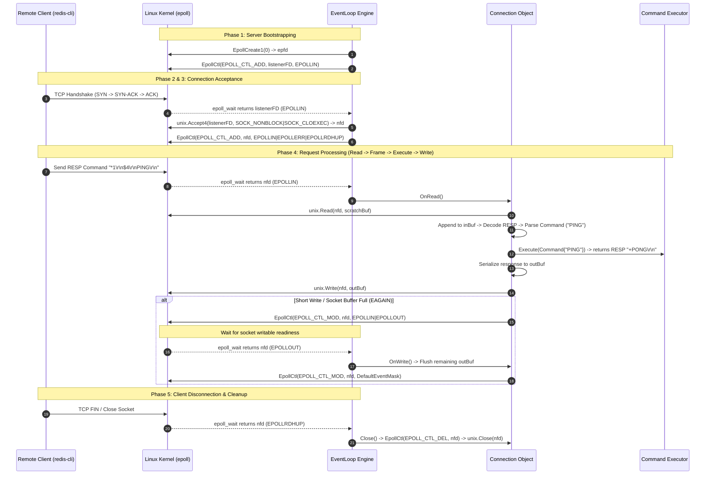

# Carrot Reactor: Master Architecture & Execution Blueprint

Welcome to the internal architectural documentation for **Carrot Reactor**—a high-performance, single-threaded, non-blocking TCP server built on Linux `epoll` system calls (`golang.org/x/sys/unix`).

This document provides a complete, step-by-step walkthrough of the entire server lifecycle: from socket creation and kernel epoll registration to non-blocking connection accepting, RESP request processing, socket buffer management, framing rewinds, remote peer resolution, and graceful shutdown.

---

## Master Architecture Map

```
                          ┌───────────────────────────────────────────────┐
                          │                 MAIN PROCESS                  │
                          └──────────────────────┬────────────────────────┘
                                                 │
                                           srv.Start()
                                                 │
             ┌───────────────────────────────────┴───────────────────────────────────┐
             │                                                                       │
             ▼                                                                       ▼
   [ PHASE 1: BOOTSTRAP ]                                                  [ PHASE 2: EVENT LOOP ]
1. unix.Socket()       -> listenerFD                                   1. poller.Wait() [epoll_wait]
2. unix.SetsockoptInt() -> SO_REUSEADDR                                               │
3. unix.Bind()         -> IP:Port                                                     ├──> listenerFD event?
4. unix.Listen()       -> Backlog=128                                                 │    └─► handleAccept()
5. NewPoller()         -> epfd (EpollCreate1)                                         │        ├─► unix.Accept4() -> nfd
6. poller.Register()   -> EPOLLIN on listenerFD                                       │        ├─► NewConnection(nfd)
7. eventLoop.Run()     -> Start Loop                                                  │        └─► poller.Register(nfd)
                                                                                      │
                                                                                      └──> Client FD event?
                                                                                           └─► handleClientEvent(fd)
                                                                                               ├─► EPOLLERR/HUP/RDHUP -> closeClient()
                                                                                               ├─► EPOLLIN  -> OnRead()
                                                                                               └─► EPOLLOUT -> OnWrite()
```

---

## End-to-End System Flow (Mermaid Sequence)



---

## Detailed Data Structure Layouts

The memory model is designed for zero context-switching and $\mathcal{O}(1)$ lookup performance:

```
┌────────────────────────────────────────────────────────────────────────┐
│ Server                                                                 │
│ ├── config: config.Config { Host: "0.0.0.0", Port: "6379" }            │
│ ├── listenerFD: 3                                                      │
│ ├── poller: *Poller                                                    │
│ └── eventLoop: *EventLoop                                              │
└──────────────────────────────────┬─────────────────────────────────────┘
                                   │
                                   ▼
┌────────────────────────────────────────────────────────────────────────┐
│ EventLoop                                                              │
│ ├── listenerFD: 3                                                      │
│ ├── poller: *Poller ──► [ epfd: 4, maxEvents: 128 ]                    │
│ ├── conns: map[int]*Connection                                         │
│ │   ├── 5 ──► Connection { fd: 5, inBuf: [...], outBuf: [...] }        │
│ │   └── 6 ──► Connection { fd: 6, inBuf: [...], outBuf: [...] }        │
│ ├── stopChan: chan struct{}                                            │
│ └── running: true                                                      │
└────────────────────────────────────────────────────────────────────────┘
```

---

## Detailed Phase-by-Phase Execution Walkthrough

---

### Phase 1: Bootstrapping the Server (`Server.Start()`)

When `Server.Start()` is invoked, it initializes the network listening socket and Linux `epoll` kernel demultiplexer in 7 explicit steps.

```
                  ┌────────────────────────────────────────┐
                  │          Server.Start() Called         │
                  └───────────────────┬────────────────────┘
                                      │
                                      ▼
             1. unix.Socket(AF_INET, SOCK_STREAM|NONBLOCK|CLOEXEC)
                                      │
                                      ▼
             2. unix.SetsockoptInt(fd, SOL_SOCKET, SO_REUSEADDR, 1)
                                      │
                                      ▼
             3. unix.Bind(fd, "0.0.0.0:6379")
                                      │
                                      ▼
             4. unix.Listen(fd, 128)
                                      │
                                      ▼
             5. NewPoller() -> unix.EpollCreate1(0)
                                      │
                                      ▼
             6. poller.Register(listenerFD)
                                      │
                                      ▼
             7. eventLoop.Run() -> Enters Infinite Loop
```

#### Step Breakdown:

1. **`unix.Socket(unix.AF_INET, unix.SOCK_STREAM|unix.SOCK_NONBLOCK|unix.SOCK_CLOEXEC, 0)`**
   * **Purpose**: Requests a new IPv4 (`AF_INET`), TCP (`SOCK_STREAM`) socket file descriptor from the Linux kernel.
   * **Flags Rationale**:
     * `SOCK_NONBLOCK`: Ensures socket operations like `Accept4()` or `Read()` return `EAGAIN` / `EWOULDBLOCK` immediately instead of blocking the thread when no data is ready.
     * `SOCK_CLOEXEC`: Sets the Close-on-Exec flag so child processes spawned via `exec` do not inherit open server handles.
   * **Return**: Assigned file descriptor integer `listenerFD` (typically `fd = 3`).

2. **`unix.SetsockoptInt(fd, unix.SOL_SOCKET, unix.SO_REUSEADDR, 1)`**
   * **Purpose**: Sets socket options at the socket API layer (`SOL_SOCKET`).
   * **Rationale**: Enables immediate rebinding to `0.0.0.0:6379` upon server restart, overriding the 30–120 second TCP `TIME_WAIT` socket cooldown period.

3. **`unix.Bind(fd, &unix.SockaddrInet4{Port: 6379, Addr: [0,0,0,0]})`**
   * **Purpose**: Binds `listenerFD` to port `6379` across all active network interfaces (`0.0.0.0`).

4. **`unix.Listen(fd, 128)`**
   * **Purpose**: Converts `listenerFD` into a passive listening socket with an OS connection backlog queue capacity of 128.

5. **`NewPoller()` $\rightarrow$ `unix.EpollCreate1(0)`**
   * **Purpose**: Asks the kernel to allocate an `epoll` instance and returns its file descriptor handle `epfd` (e.g., `epfd = 4`).

6. **`s.poller.Register(listenerFD)`**
   * **Purpose**: Executes `unix.EpollCtl(epfd, unix.EPOLL_CTL_ADD, listenerFD, &event)` with `DefaultEventMask` (`EPOLLIN | EPOLLERR | EPOLLRDHUP`).
   * **Rationale**: Instructs the kernel: *"Monitor `listenerFD`. Wake me up when an incoming client triggers a read event (`EPOLLIN`)."*

7. **`s.eventLoop.Run()`**
   * **Purpose**: Sets `running = true` inside a thread-safe mutex lock and launches the main event loop.

---

### Phase 2: The Core Event Multiplexing Loop (`EventLoop.Run()`)

The main event loop runs on a single thread and processes ready network file descriptors returned by `epoll_wait`.

```go
for {
    select {
    case <-el.stopChan:
        el.cleanup()
        return nil
    default:
    }

    events, err := el.poller.Wait() // Invokes unix.EpollWait(epfd, events, -1)
    if err != nil {
        if errors.Is(err, unix.EINTR) {
            continue // Signal interrupt (e.g. SIGINT); retry loop
        }
        return err
    }

    for _, ev := range events {
        if ev.FD == el.listenerFD {
            el.handleAccept()
        } else {
            el.handleClientEvent(ev.FD, ev.Events)
        }
    }
}
```

> [!NOTE]
> **Zero CPU Overhead During Idle**:
> When no events are ready, `unix.EpollWait` puts the thread to sleep in the kernel. The server consumes 0% CPU while waiting for traffic.

---

### Phase 3: Accepting New Connections (`handleAccept()`)

When a client initiates a TCP handshake, `listenerFD` becomes readable (`EPOLLIN`).

```
                            [ Client Sends TCP SYN ]
                                       │
                                       ▼
                       epoll wakes up on listenerFD
                                       │
                                       ▼
                              el.handleAccept()
                                       │
                                       ▼
              loop { unix.Accept4(listenerFD, NONBLOCK|CLOEXEC) }
                                       │
                    ┌──────────────────┴──────────────────┐
                    ▼                                     ▼
             [ Success: nfd=5 ]                    [ Error: EAGAIN ]
                    │                                     │
                    ▼                                     ▼
           NewConnection(nfd=5)                    Backlog fully drained.
                    │                                  break loop.
                    ▼
           conns[5] = conn
                    │
                    ▼
         poller.Register(nfd=5)
   (Registers DefaultEventMask:
 EPOLLIN | EPOLLERR | EPOLLRDHUP)
```

1. **`unix.Accept4(listenerFD, unix.SOCK_NONBLOCK|unix.SOCK_CLOEXEC)`**:
   - Non-blockingly accepts pending connections from the listening socket queue, returning a new client socket file descriptor (e.g., `nfd = 5`).
   - Automatically sets non-blocking mode on `nfd` in a single system call.
2. **`NewConnection(nfd, poller, parser, executor)`**:
   - Instantiates a `Connection` struct holding `nfd`, input/output buffers (`inBuf`, `outBuf`), and RESP codec references.
3. **Map Registry (`el.conns[nfd] = conn`)**:
   - Registers the connection in `el.conns map[int]*Connection` for $\mathcal{O}(1)$ lookup when events fire on `nfd`.
4. **Epoll Registration**:
   - Registers `nfd` with `Poller` monitoring `EPOLLIN | EPOLLERR | EPOLLRDHUP`.
5. **Loop Draining**:
   - Loops until `Accept4` returns `EAGAIN` or `EWOULDBLOCK`, ensuring all backlogged connections are accepted before returning to `epoll_wait`.

---

### Phase 4: Processing Client Requests & Data Flow (`handleClientEvent()`)

When data arrives from a client (e.g., `*1\r\n$4\r\nPING\r\n`):

```
                        [ Client Sends "PING" Bytes ]
                                      │
                                      ▼
                      epoll wakes up on Client FD (fd=5)
                                      │
                                      ▼
                       el.handleClientEvent(fd=5, events)
                                      │
              ┌───────────────────────┼───────────────────────┐
              ▼                       ▼                       ▼
     events & EPOLLERR/HUP/RDHUP  events & EPOLLIN        events & EPOLLOUT
              │                       │                       │
              ▼                       ▼                       ▼
      el.closeClient(5)          conn.OnRead()           conn.OnWrite()
```

#### Step 4A: Handling Disconnections & Socket Errors
```go
if events&(unix.EPOLLERR|unix.EPOLLHUP|unix.EPOLLRDHUP) != 0 {
    el.closeClient(fd)
    return
}
```
* **`EPOLLERR`**: Unrecoverable socket error.
* **`EPOLLHUP`**: Socket hangup (client closed TCP connection).
* **`EPOLLRDHUP`**: Remote peer shut down writing half of TCP socket.
* **Action**: `el.closeClient(fd)` unregisters FD from epoll, calls `unix.Close(fd)`, and deletes `fd` from `el.conns`.

---

#### Step 4B: Non-Blocking Reading, Buffer Framing & Parser Rewind (`OnRead()`)

```
                           conn.OnRead()
                                │
                                ▼
         unix.Read(c.fd, tempBuf) -> Reads raw socket bytes
                                │
                                ▼
               Appends bytes into c.inBuf buffer
                                │
                                ▼
         processCommands() -> Framing & Rewind Loop
                                │
         ┌──────────────────────┴──────────────────────┐
         ▼                                             ▼
  Full RESP Command In Buffer                 Partial TCP Payload
 (e.g., "*1\r\n$4\r\nPING\r\n")             (e.g., "*1\r\n$4\r\nPIN")
         │                                             │
         ▼                                             ▼
  1. respDecoder.Decode()                       1. decoder returns io.EOF /
  2. commandParser.Parse()                         io.ErrUnexpectedEOF
  3. commandExecutor.Execute()                  2. Break parsing loop
  4. consumed := len(raw) - reader.Len()        3. Leave unparsed bytes in inBuf
  5. c.inBuf.Next(consumed)                     4. Wait for next EPOLLIN event
  6. Repeat loop for pipelined cmds
         │
         ▼
  writeResponse() -> c.outBuf
         │
         ▼
     c.Flush()
```

> [!IMPORTANT]
> **TCP Framing & Buffer Rewind Algorithm (`Connection.processCommands`)**:
> 1. `raw := c.inBuf.Bytes()` creates an unconsumed snapshot of incoming bytes.
> 2. `reader := bytes.NewReader(raw)` $\rightarrow$ `bufReader := bufio.NewReader(reader)` $\rightarrow$ `respDecoder := resp.NewDecoder(bufReader)`.
> 3. If `respDecoder.Decode()` encounters `io.EOF` or `io.ErrUnexpectedEOF`, the packet payload is incomplete. The loop breaks without modifying `c.inBuf`, preserving partial bytes until the next `EPOLLIN` event!
> 4. When a full command is decoded: `consumed := len(raw) - reader.Len()` calculates consumed bytes, and `c.inBuf.Next(consumed)` advances the buffer.
> 5. The loop repeats while `c.inBuf.Len() > 0` to support **pipelined commands** (multiple commands in one network packet).

---

#### Step 4C: Non-Blocking Socket Writing & Dynamic `EPOLLOUT` (`Flush()` / `OnWrite()`)

```go
// Flush writes outbound bytes to socket
for c.outBuf.Len() > 0 {
    n, err := unix.Write(c.fd, c.outBuf.Bytes())
    if n > 0 {
        c.outBuf.Next(n) // Drain written bytes
    }
    if err != nil {
        if errors.Is(err, unix.EAGAIN) || errors.Is(err, unix.EWOULDBLOCK) {
            // Socket send buffer full! Enable EPOLLOUT interest
            return c.poller.Modify(c.fd, DefaultEventMask|unix.EPOLLOUT)
        }
        if errors.Is(err, unix.EINTR) {
            continue
        }
        return err
    }
}
// All bytes sent! Reset interest mask back to default
return c.poller.Modify(c.fd, DefaultEventMask)
```

### Epoll Socket Interest State Transition Matrix

```
┌─────────────────┐       EAGAIN on unix.Write()       ┌─────────────────┐
│ Registered FD   ├───────────────────────────────────►│ Writable FD     │
│ (EPOLLIN |      │                                    │ (EPOLLIN |      │
│  EPOLLERR |     │◄───────────────────────────────────┤  EPOLLOUT |     │
│  EPOLLRDHUP)    │     c.outBuf.Len() == 0 (Flushed)  │  EPOLLERR |     │
└────────┬────────┘                                    │  EPOLLRDHUP)    │
         │                                             └─────────────────┘
         │ Client Close / EPOLLRDHUP
         ▼
┌─────────────────┐
│ Unregistered FD │
│ (unix.Close)    │
└─────────────────┘
```

1. **Full Write**: If all bytes fit into the kernel socket send buffer, `c.outBuf` is emptied, and interest mask remains `DefaultEventMask`.
2. **Partial Write (`EAGAIN`)**: If kernel send buffer is full, `Flush()` modifies epoll interest to include `unix.EPOLLOUT`.
3. **OnWrite Event**: When kernel write buffer has space, epoll triggers `EPOLLOUT`. `OnWrite()` calls `Flush()` to send remaining queued bytes, and resets the interest mask back to `DefaultEventMask` once `c.outBuf` is cleared.

---

### Step 4D: Remote Peer Address Resolution (`conn.RemoteAddr()`)

To log client connections cleanly without net package abstractions, `Connection.RemoteAddr()` queries the kernel peer name directly:

```go
sa, err := unix.Getpeername(c.fd)
if err != nil {
    return nil
}
switch sa := sa.(type) {
case *unix.SockaddrInet4:
    return &net.TCPAddr{ IP: sa.Addr[:], Port: sa.Port }
case *unix.SockaddrInet6:
    return &net.TCPAddr{ IP: sa.Addr[:], Port: sa.Port }
}
```

---

### Phase 5: Graceful Shutdown (`Server.Stop()`)

```
                        [ Main Thread / Goroutine A ]
                                      │
                                 srv.Stop()
                                      │
                                      ▼
                             eventLoop.Stop()
                                      │
                                      ▼
                             close(el.stopChan)
                                      │
                                      ▼
               [ EventLoop Thread / Goroutine B Wakes Up ]
                                      │
                            case <-el.stopChan: HIT!
                                      │
                                      ▼
                                 el.cleanup()
                                      │
         ┌────────────────────────────┴────────────────────────────┐
         ▼                                                         ▼
Iterates el.conns map:                                  unix.Close(epfd)
- conn.Close() -> unregisters & unix.Close(clientFD)    closes epoll instance
- delete(el.conns, clientFD)
                                      │
                                      ▼
                           unix.Close(listenerFD)
                           (Closes Server Socket)
                                      │
                                      ▼
                         [ Process Exits Cleanly ]
```

1. Main thread calls `srv.Stop()`, closing `el.stopChan`.
2. EventLoop wakes up, calls `el.cleanup()`.
3. Unregisters and closes all active client FDs (`conn.Close()`).
4. Closes epoll handle `epfd` and server listener `listenerFD`.

---

## Complete Operating System Error Handling Matrix

| OS Errno / Return Code | System Call Context | Meaning in Reactor | Reactor Action & Recovery Strategy |
| :--- | :--- | :--- | :--- |
| `EAGAIN` / `EWOULDBLOCK` | `unix.Accept4` | Listener backlog queue is empty. | Break accept loop; return to `epoll_wait`. |
| `EAGAIN` / `EWOULDBLOCK` | `unix.Read` | Client socket receive buffer is empty. | Break read loop; trigger `processCommands()`. |
| `EAGAIN` / `EWOULDBLOCK` | `unix.Write` | OS socket send buffer is full. | Modify epoll mask to `DefaultEventMask \| EPOLLOUT`; flush on next `EPOLLOUT`. |
| `EINTR` | Any Syscall | Interrupted by OS signal (e.g. `SIGINT`). | Non-fatal; automatically retry system call immediately. |
| `0` (Zero Bytes Read) | `unix.Read` | Remote client closed TCP connection (EOF). | Return `io.EOF`, unregister FD, close socket descriptor. |
| `EBADF` | `unix.Close` | Bad file descriptor (already closed). | Ignored safely during double-close guard check. |

---

## Comprehensive Component Matrix

| Layer | Primary Struct | Primary File | Key System Calls | Role & Responsibility |
| :--- | :--- | :--- | :--- | :--- |
| **Server** | `Server` | [server.go](file:///c:/Users/acer/Desktop/carrot-window/carrot/internal/reactor/server.go) | `unix.Socket`, `unix.SetsockoptInt`, `unix.Bind`, `unix.Listen` | Socket instantiation, IP binding, server lifecycle control. |
| **Poller** | `Poller` | [poller.go](file:///c:/Users/acer/Desktop/carrot-window/carrot/internal/reactor/poller.go) | `unix.EpollCreate1`, `unix.EpollCtl`, `unix.EpollWait`, `unix.Close` | Direct epoll system call wrapper managing kernel interest trees. |
| **EventLoop** | `EventLoop` | [event_loop.go](file:///c:/Users/acer/Desktop/carrot-window/carrot/internal/reactor/event_loop.go) | `unix.Accept4`, `unix.Close` | Single-threaded multiplexing engine, accept loop, event router. |
| **Connection** | `Connection` | [connection.go](file:///c:/Users/acer/Desktop/carrot-window/carrot/internal/reactor/connection.go) | `unix.Read`, `unix.Write`, `unix.Getpeername`, `unix.Close` | Non-blocking client socket I/O, byte buffers, framing, RESP codec integration. |