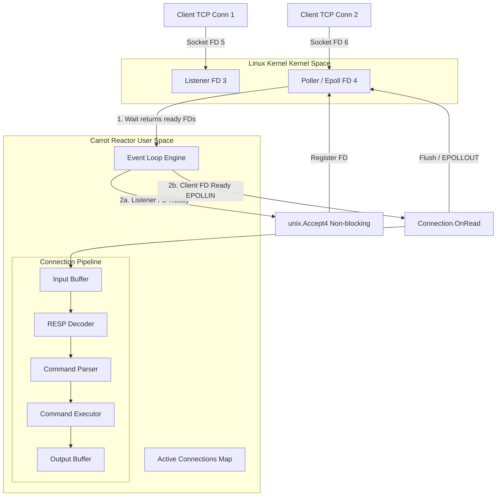
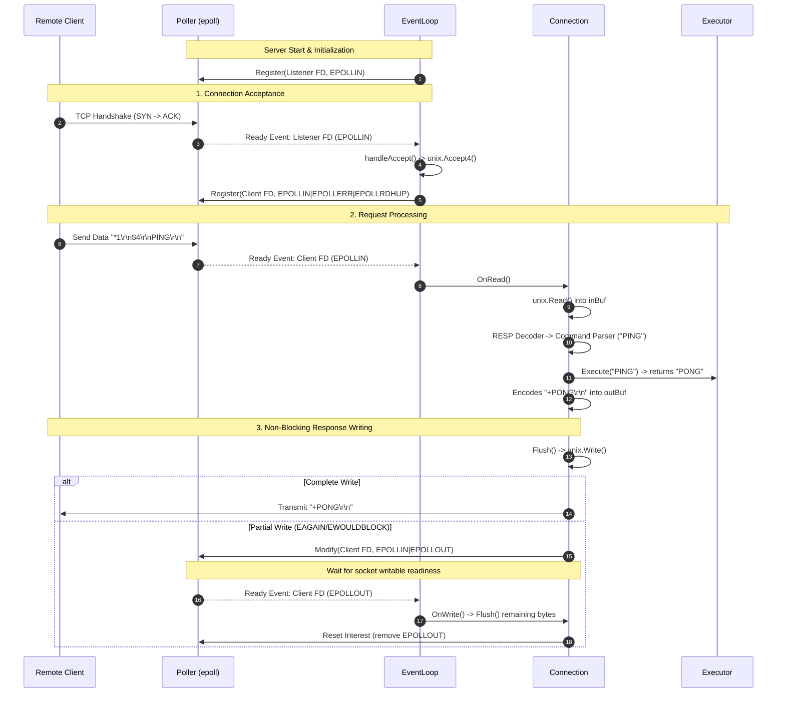

#  Carrot Reactor: Event Loop & System Call Engine (HLD & LLD)

This package (`internal/reactor`) implements a high-performance, single-threaded **Reactor Event Loop** pattern using Linux native `epoll` system calls (`golang.org/x/sys/unix`).

It provides non-blocking, asynchronous I/O multiplexing for TCP client connections—similar to the core networking architecture used by Redis, Nginx, and Node.js.

---

## High-Level Architecture (HLD)

### Per-Client Goroutine vs. Reactor Architecture

| Architecture | Model | Concurrency Unit | Memory Overhead | Use Case |
| :--- | :--- | :--- | :--- | :--- |
| **Per-Client Goroutine** (`internal/server`) | 1 Goroutine per Connection | Go Runtime Scheduler | ~2KB to 8KB per stack | Simple, thread-per-conn simplicity |
| **Reactor Event Loop** (`internal/reactor`) | 1 Thread / Event Loop | System File Descriptors | Minimal (Shared event buffer) | High concurrency (C10K/C1000K), zero context switching |

---

## Complete System Flow & Diagrams

### 1. Overall System Architecture & Data Flow




---

### 2. Detailed Epoll & Event Loop Lifecycle Sequence




---

## Low-Level Design (LLD): Component Deep Dive

The package is composed of 4 core modules:

```
internal/reactor/
├── poller.go        # Linux epoll system call wrapper
├── connection.go    # Non-blocking socket state & buffer manager
├── event_loop.go    # Multiplexing engine & event dispatcher
├── server.go        # Socket creation, binding & server lifecycle
└── README.md        # Architecture & Design Documentation
```

---

### 1. `poller.go` — Low-Level Epoll System Call Wrapper

`Poller` is a thin, zero-abstraction wrapper around Linux `epoll` system calls. It knows **nothing** about TCP, RESP protocol, or connection state.

#### Key Structs & Constants:
```go
const DefaultEventMask = unix.EPOLLIN | unix.EPOLLERR | unix.EPOLLRDHUP

type Event struct {
    FD     int
    Events uint32
}

type Poller struct {
    epfd      int // File descriptor of epoll instance
    maxEvents int // Capacity for ready events per epoll_wait call
}
```

#### Core System Calls Used:
* **`unix.EpollCreate1(0)`**: Requests the Linux kernel to create an epoll instance (`epfd`).
* **`unix.EpollCtl(epfd, op, fd, event)`**:
  * `EPOLL_CTL_ADD`: Registers a socket FD to monitor.
  * `EPOLL_CTL_MOD`: Modifies monitored events (e.g., adding `EPOLLOUT`).
  * `EPOLL_CTL_DEL`: Removes a socket FD from monitoring.
* **`unix.EpollWait(epfd, events, timeout)`**: Blocks until one or more file descriptors become ready for I/O. Automatically handles signal interrupts (`EINTR`).

---

### 2. `connection.go` — Non-Blocking Socket & Buffer State

`Connection` encapsulates a client socket file descriptor (`fd`) and manages non-blocking read/write buffers.

#### Responsibilities:
1. **Non-Blocking Read (`OnRead`)**:
   - Calls `unix.Read(fd, buf)` in a loop until `EAGAIN` or `EWOULDBLOCK` is returned.
   - Appends read bytes into an input buffer (`inBuf`).
   - Handles EOF (client disconnect) when `n == 0`.
2. **RESP Framing & Partial Parsing**:
   - Inspects `inBuf` using `resp.NewDecoder`.
   - If payload is incomplete (`io.EOF` / `io.ErrUnexpectedEOF`), retains data in `inBuf` until next `EPOLLIN`.
   - On full command parse: passes to `command.Parser` $\rightarrow$ `command.Executor` $\rightarrow$ encodes response into output buffer (`outBuf`).
3. **Non-Blocking Write & Flush (`Flush` / `OnWrite`)**:
   - Writes pending bytes via `unix.Write(fd, outBuf)`.
   - If socket write buffer fills (`EAGAIN`), enables `EPOLLOUT` interest in `Poller` so remaining data is sent when socket becomes writable again.
   - Disables `EPOLLOUT` interest once `outBuf` is completely drained.

---

### 3. `event_loop.go` — Multiplexing Engine & Event Dispatcher

`EventLoop` is the driver of the Reactor. It executes an infinite event loop that processes ready system events.

#### Core Loop Algorithm:
```
while running:
    events = poller.Wait()
    for ev in events:
        if ev.FD == listenerFD:
            handleAccept()
        else:
            handleClientEvent(ev.FD, ev.Events)
```

#### Event Dispatch Strategy:
* **`handleAccept()`**:
  - Invokes `unix.Accept4(listenerFD, unix.SOCK_NONBLOCK|unix.SOCK_CLOEXEC)` in a loop to accept all pending incoming client connections without blocking.
  - Registers new client FDs with `Poller` (`EPOLLIN`).
  - Stores `Connection` in active registry `conns map[int]*Connection`.
* **`handleClientEvent(fd, events)`**:
  - `EPOLLERR | EPOLLHUP | EPOLLRDHUP`: Client disconnected or socket error $\rightarrow$ Closes connection & unregisters FD.
  - `EPOLLIN`: Data available $\rightarrow$ calls `conn.OnRead()`.
  - `EPOLLOUT`: Socket ready for writing $\rightarrow$ calls `conn.OnWrite()`.

---

### 4. `server.go` — Non-Blocking TCP Socket Initialization

`Server` handles socket creation and startup sequence using raw Linux system calls:

1. **Create Non-Blocking Socket**:
   `unix.Socket(unix.AF_INET, unix.SOCK_STREAM|unix.SOCK_NONBLOCK|unix.SOCK_CLOEXEC, 0)`
2. **Set SO_REUSEADDR**:
   `unix.SetsockoptInt(fd, unix.SOL_SOCKET, unix.SO_REUSEADDR, 1)`
3. **Bind Address**:
   `unix.Bind(fd, &unix.SockaddrInet4{Port: port, Addr: ipBytes})`
4. **Listen**:
   `unix.Listen(fd, 128)`
5. **Start Event Loop**:
   Creates `Poller`, registers `listenerFD`, and runs `EventLoop.Run()`.

---

## Comprehensive Step-by-Step Command Lifecycle

Let's trace what happens when a client sends `PING hello`:

1. **Network Packet Arrival**: Client sends `*2\r\n$4\r\nPING\r\n$5\r\nhello\r\n`.
2. **Kernel Notification**: Linux kernel marks socket `FD 6` as readable in epoll tree.
3. **Epoll Wakeup**: `poller.Wait()` unblocks and returns `Event{FD: 6, Events: EPOLLIN}`.
4. **Event Dispatch**: `EventLoop` routes event to `handleClientEvent(6, EPOLLIN)`.
5. **Non-Blocking Read**: `conn.OnRead()` invokes `unix.Read(6, buf)`, reading bytes into `c.inBuf`.
6. **RESP Decoding**: `resp.Decoder` parses Array of 2 Bulk Strings (`PING`, `hello`).
7. **Command Execution**: `command.Executor` runs `PING hello`, returning Bulk String `Value{Type: BulkString, String: "hello"}`.
8. **Response Encoding**: `resp.Encoder` formats `$5\r\nhello\r\n` into `c.outBuf`.
9. **Socket Write**: `conn.Flush()` writes bytes via `unix.Write(6, data)`.
10. **State Clean Up**: Input buffer advanced, output buffer cleared, event loop waits for next event.

---

